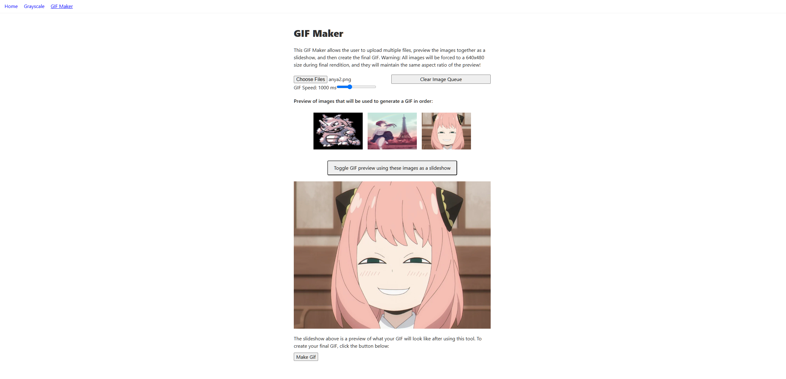
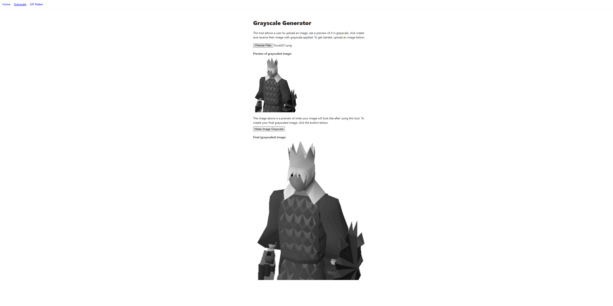

## Gif-Maker

This project is a web-based GIF maker that utilizes the `gif-encoder` and the `sharp` packages to render and locally encode a GIF to a web page utilizing uploaded JPG images. This utilizies a basic REST API system and back-end on S3 that can be viewed in the `/pages/api/` folder.

View of the GIf-Maker:

View of the Grayscale image generator:

Here's a demo of the web application on a live server with a S3 back-end:

